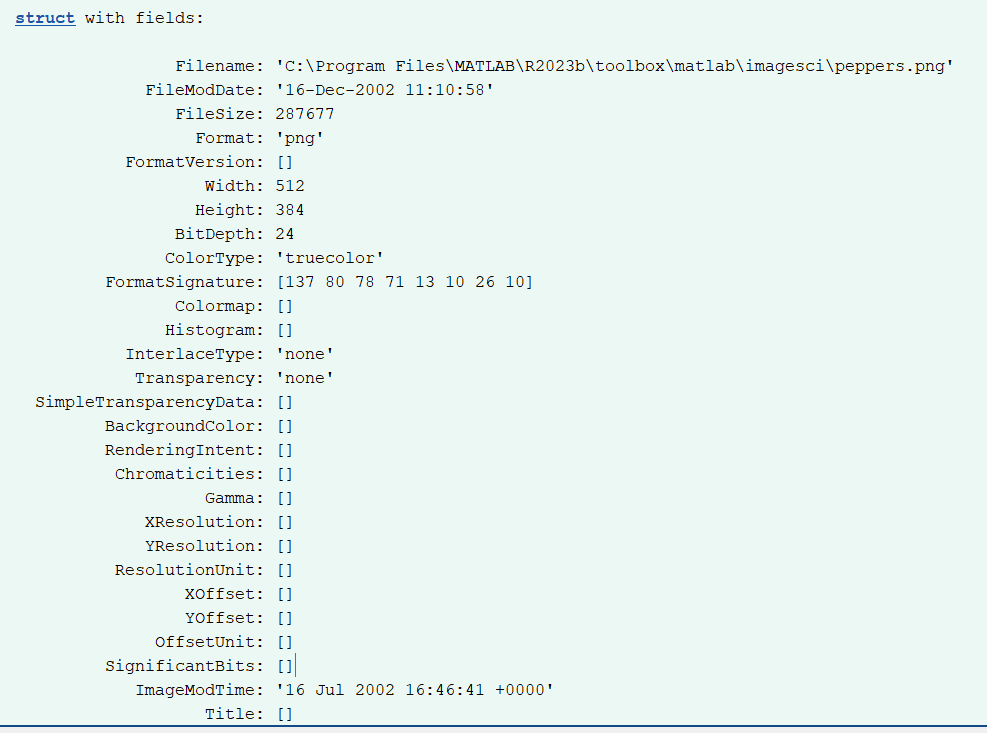
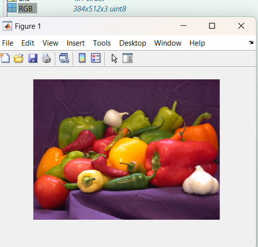
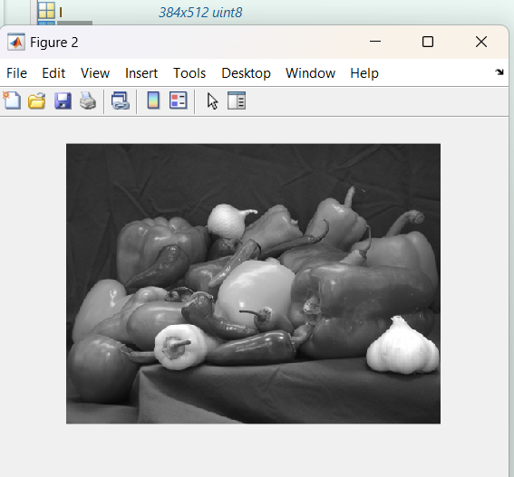
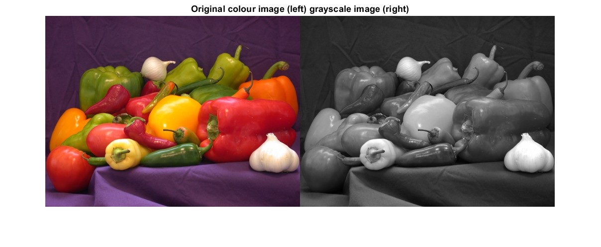
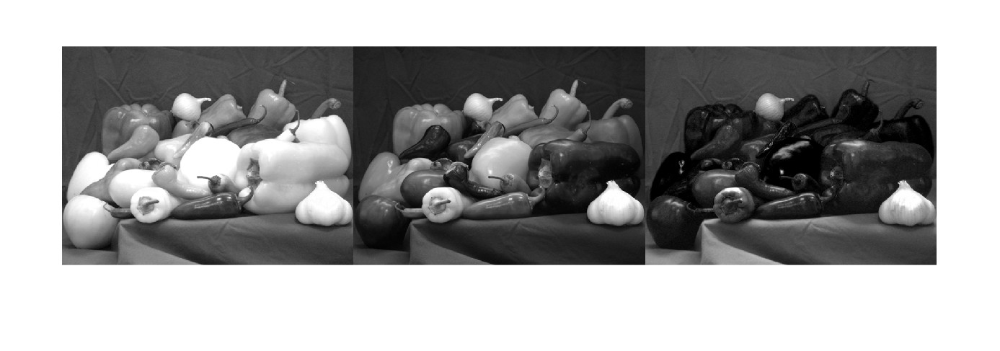
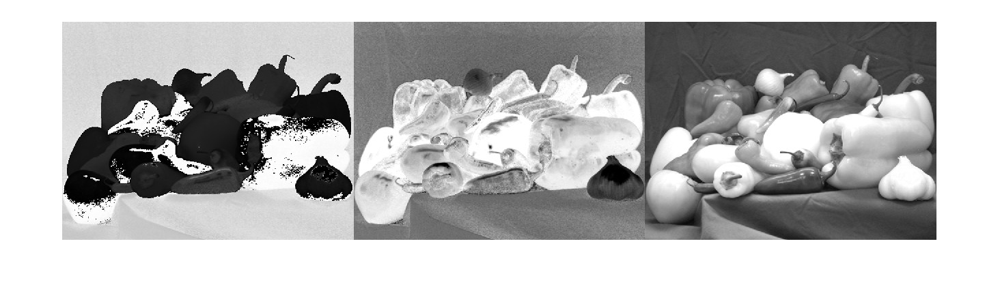
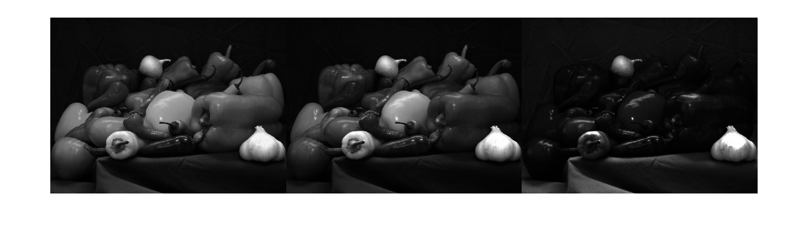

# Lab 2 - Colour Perception
## Section 1: Optical Illusions

## 1 - Blind Spot


There are sections of the image where the brain fills in the blind spot area based on surroundings, when they are in the edge of the line of sight

## 2 - Ishihara Test
Colour blind colour dots test - helps detect medium and long cone deficiencies (red-green colourblindness)


## 3 - Reverse Colour

1. Get hold of a white sheet of paper and hold it up next to your screen.
2. Now stare at white dot in the centre image below for 10+ secs.
3. Quickly switch gaze to the white sheet of paper.


Observed: Image of flag with red, white, blue US flag colours on the paper
Why? (TBD)

## 4 - Troxler's Fading

Visual information disappears from peripheral view once the brain adapts to it and regards it as useless information


## 5 - Brain Sees What it Expects


A and B are the same colour but the eyes interpret B as lighter due to the expected pattern in the shadow


## 6 - Grid Illusion


## 7 - Cafe Wall Illusion


This does not happen to the same kind of image but with lower contrasting colours

## 8 - Silhouette Illusion

http://www.ee.ic.ac.uk/pcheung/teaching/DE4_DVS/assets/dancer.m4v

Rotating dancer can be seen as rotating clockwise or counterclockwise
## 9 - Incomplete Triangles 


Even though none of these are complete triangles, the brain interprets them as fully complete triangles because of the negative spaces. It seems to fill in the gaps based on what it expects

---
# Section 2: Colours in Matlab

Mmmm peppers


## Task 10 - Convert RGB to Greyscale

Full colour images have too much information and require unnecessary calculations.
We can turn the colour image to greyscale to prep for processes like feature extraction.

#### Return some information about the image
```
imfinfo('peppers.png')
```


#### Add data into an array and display
```
RGB = imread('peppers.png')
imshow(RGB)
```



The 3 dimensional RGB array now holds a lot of information -- 384x512x3 uint8

#### Conversion to Greyscale
Conversion to greyscale uses the equation: $I = 0.299 * R + 0.587 * G + 0.114 * B$
or in matrix form:


The function `rgb2gray()` converts RGB to greyscale by forming a weighted sum of RGB components (through the equation)

```
I = rgb2gray(RGB);
figure  % this starts a new figure window
imshow(I)
```



Observe how the GS image is only a 2 dimensional array 384x512 uint8
#### Compare Images
Compare images using `imshowpair()`, the method `'montage'` will show it side by side.
More on image comparison methods [here](https://uk.mathworks.com/help/images/ref/imshowpair.html#bta3ucy-1-method)

```
imshowpair(RGB, I, 'montage')
title('Original colour image (left) grayscale image (right)');
```



## Task 11 - Splitting RGB image to separate channels
`imsplit()` separates the image, then display as three side-by-sides with `montage()`

```
[R,G,B] = imsplit(RGB);
montage({R, G, B},'Size',[1 3])
```



Some observations:
* The red peppers give stronger signals in the red (leftmost) channel (thus being more white)
* Yellow and Green peppers have signal in both red and green channels 
* White objects like garlic show up on all channels

Note that each of the three (R, G, B) arrays are 2 dimensional arrays 384x512 uint8 just like I (the greyscale one) - which makes sense as the arrays are split from the original RGB

## Task 12 - Map RGB to HSV space and separate channels

`rgb2hsv()` changes RGB to HSV. 
Then split to components as above.

```
HSV = rgb2hsv(RGB);
[H,S,V] = imsplit(HSV);
montage({H,S,V}, 'Size', [1 3])
```




## Task 13 - Map RGB to XYZ space

`rgb2xyz()` changes RGB to XYZ. 
Then split to components as above.

```
XYZ = rgb2xyz(RGB);
[X,Y,Z] = imsplit(XYZ);
montage({X,Y,Z}, 'Size', [1 3])
```


